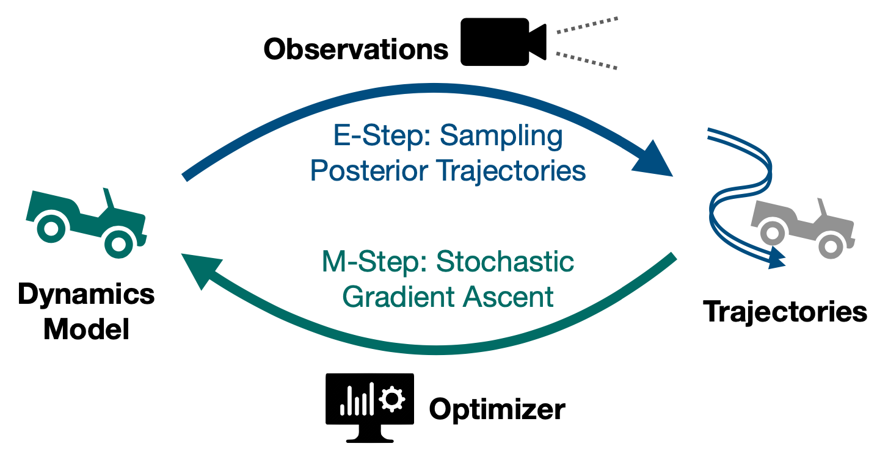

# STEADY

_Learning stochastic dynamical systems from noisy and indirect obseravtions._


This repo contains the source code for the paper [STEADY: Simultaneous State Estimation and Dynamics Learning from Indirect Observations](https://arxiv.org/abs/2203.01299). 


## Installing project dependencies
This project is written in [Julia](https://julialang.org/) and is tested on both MacOS and Ubuntu. We provide the script [install_linux.py](install_linux.py) to automatically install the binary dependencies on Linux.

When running the project for the first time, open the Julia REPL using the command `julia --project`.
Then, inside the REPL, type `>` followed by `instantiate` to let julia download all dependended packages and perform a precompilation.

Finally, create a file at `<proejct root>/configs/datadir.txt` and use its content to specify the location at which the trained models should be saved. e.g., 
```bash
mkdir configs; echo "data" > configs/datadir.txt
```

## Training kinodynamic models
To start training, inside the Julia REPL, first config the experiment
setting by defining a global variable named `script_args`:
```julia
script_args = (
    scenario=SEDL.RealCarScenario("alpha_truck"),
    train_method=:EM,
    gpu_id=0,
)
```
This specifies that we want to train on the ["alpha_truck" dataset](datasets/alpha_truck/) using expectation-maximization (i.e., the STEADY algorithm). `gpu_id=0` means that we want to use the first available GPU (set this to `nothing` if train on CPU). You can find the fully list of configurable parameters along with their acceptable values [here](https://github.com/MrVPlusOne/STEADY/blob/master/scripts/experiments/experiment_common.jl#L13).

We can then start the training with:
```julia
include("scripts/turn_off_displays.jl"); # this is only needed when a plot pane is not available. e.g., when running inside an ssh shell.
include("scripts/train_models.jl") # this starts the training
```

We also produce the following scripts to reproduce our paper results:

- [baseline_experiments.jl](scripts/experiments/baseline_experiments.jl): Corresponding to the "Main results" Section of the paper.
- [obs_noise_variation.jl](scripts/experiments/obs_noise_variation.jl): The "Impact of Observation Noise" Section.
- [particle_variation.jl](scripts/experiments/particle_variation.jl): The "Impact of Particle Quantity" Section.


## A step-by-step tutorial
Coming soon!
